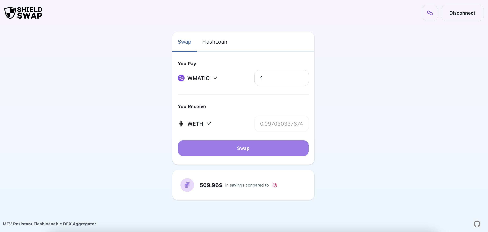

# SHIELD SWAP

MEV Resistant Flashloanable DEX Aggregator

## Live Demo

https://2022-eth-seoul-submission.vercel.app/



## Technical Integration

### The graph

#### Diagram


#### Used subgraph

https://thegraph.com/hosted-service/subgraph/0xfind/uniswap-v3-mumbai

- Success to integarte uniswap v3 in mumbai
- subgraph for quickswap mumbai and sushiswap mumbai is not available, we can add subgraph for those later

#### How we use The Graph

The graph is used for aggregating pool info. We are aggregating all pool informaion from event, but we can have better performance using The Graph.

#### Line of integration

https://github.com/fortoon21/JK_bridge/blob/c335665a3f99eb632d48bf190a028daea13b4f18/packages/aggregator/lib/viewer.ts#L218-L221

https://github.com/fortoon21/JK_bridge/blob/c335665a3f99eb632d48bf190a028daea13b4f18/packages/aggregator/lib/thegraph.ts#L5-L10

### Polygon

#### Deployed Contracts

##### Route Proxy

- https://mumbai.polygonscan.com/address/0xE8cb4b4b47bFF4c12a599FdB13b751C4f41974Ff#code
- This is for handling aggregated swap

##### Token Viewer

- https://mumbai.polygonscan.com/address/0x1a2e1CCb2702A3c30Fb04A80918eA0d0f6C06D8A#code
- This is for aggregating info from token in multicall

##### Token Viewer

- https://mumbai.polygonscan.com/address/0x4a44b451d9239e60E5A3df7214b2c467b7148902#code
- This is for aggregating info from uniswap v2 type dex in multicall

##### Token Viewer

- https://mumbai.polygonscan.com/address/0x60D3e7ba1781281f04B316e79CF389460B2ddB31#code
- This is for aggregating info from uniswap v3 type dex in multicall

##### Others

All contract information is kept at
https://github.com/fortoon21/Shieldswap/blob/ed969d0a5831a18f1e0c0deca6d79b54b6c132d0/packages/aggregator/address.json

#### How we use Polygon

We are aggregating pool info from quickswap, sushiswap, uniswap V3 deployed in Polygon Mumbai, then provider aggregated swap to user.

We deployed multicall viewer contract and swap contract in Polygon Mumbai.

## Development

### Frontend

```
cd packages/frontend
yarn                    // for the first time
yarn dev
```

### Aggregator

```
cd packages/aggregator
yarn                    // for the first time
yarn test
```
